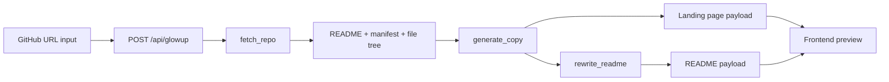

# Architecture

The API layer owns orchestration and validation. The agent package owns the three product capabilities, so each can be tested independently or swapped for a Strands/Bedrock implementation without changing the UI contract. The frontend remains a thin client: it submits one URL, renders explicit progress, then renders the output payload.
